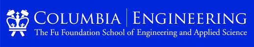
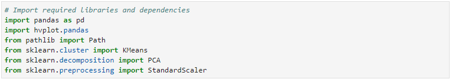

# Clustering Cryptocurrencies

___
This week, I will utilize Python as well as unsupervised learning. Unsupervised learning tries to make sense of an unlabeled dataset by extracting features and patterns on its own. Specifically, this notebook will create clusters of cryptocurrencies based on their performance in different time periods and then use Principal Component Analysis (PCA), a dimensionality reduction method, or compressing large data and only keeping the most useful information. Additionally, I will normalize data by applying standard scaling, a method of centering values around their mean.

---

## Technologies

This project leverages python 3.7 with various Libraries and IDE:

* [Jupyterlab](http://justinbois.github.io/bootcamp/2020_fsri/lessons/l01_welcome.html#Jupyter) - An interactive development environment

* [PyViz](https://pyviz.org/overviews/index.html) - a is a Python visualization package that provides a single platform for accessing multiple visualization libraries, including hvPlot and GeoViews.

* [hvPlot](https://hvplot.holoviz.org/user_guide/Plotting.html) -  a high-level plotting API built on HoloViews that provides a general and consistent API for plotting data in various formats.

* [Scikit-learn](https://scikit-learn.org/stable/getting_started.html) - a machine learning library that supports supervised and unsupervised learning.

---

## Installation Guide

In order to run the application, one should first install SQLAlchemy and Voila.

* Install Scikit Learn

* Install hvPlot

---

## Usage
To use the analysis, clone the repository and run the etf_analyzer.ipynb notebook within the Jupyter Notebook.

---

## Contributors

Brought to you by Franco Thomas via the Columbia Engineering FinTech Bootcamp.

Significant contributions made by subcontractors Professor Marghub Mirza, TA Ashfaque, and TA Boomin Kwon.

---

## License

MIT